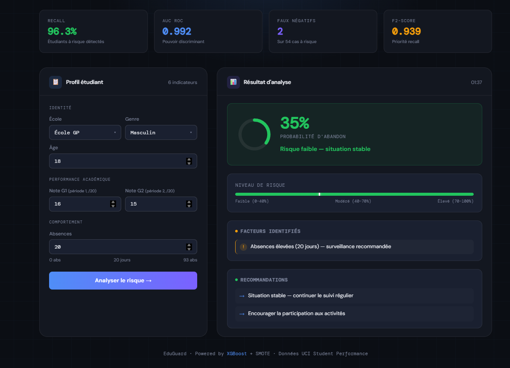
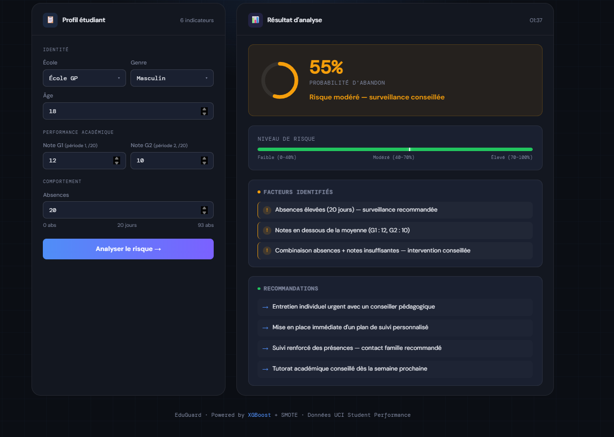
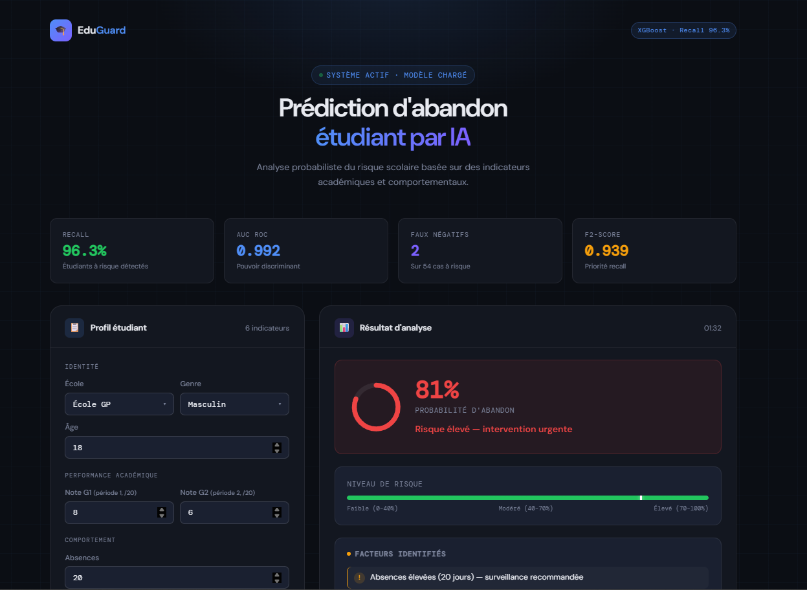
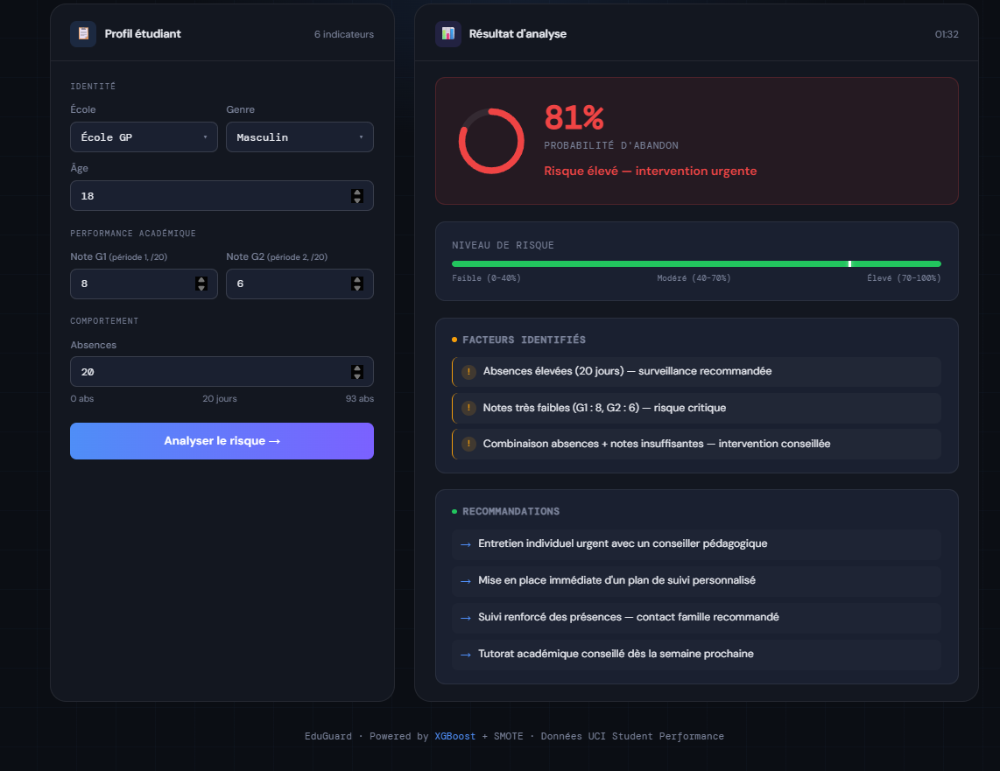

# 🎓 EduGuard — Prédiction d'Abandon Étudiant

Système de machine learning pour prédire le risque d'abandon scolaire des étudiants, permettant une intervention précoce via une interface web moderne.

---

## 📸 Démonstration

| Risque faible | Risque modéré |
|---|---|
|  |  |

| Risque élevé | Vue générale |
|---|---|
|  |  |

---

## 📋 Description

EduGuard analyse le profil académique, comportemental et familial d'un étudiant pour estimer sa probabilité d'abandon. Le personnel éducatif peut ainsi intervenir avant qu'il ne soit trop tard.

---

## 📊 Dataset

- **Source** : [UCI Student Performance Dataset](https://archive.ics.uci.edu/ml/datasets/Student+Performance) — Paulo Cortez, Université do Minho, Portugal
- **Échantillons** : ~650 étudiants
- **Features** : 33 variables (démographiques, sociales, académiques)
- **Target** : `dropout_risk` (0 = faible risque, 1 = haut risque) — créée à partir des critères académiques

---

## 🤖 Résultats du modèle

| Métrique | Valeur |
|---|---|
| Recall | **96.3%** — 52/54 cas à risque détectés |
| AUC ROC | 0.992 |
| F2-Score | 0.939 |
| Faux négatifs | 2 sur 54 cas à risque |
| Précision | 85.2% |

### Comparaison des modèles

| Modèle | Recall | Précision | F2-Score | Faux Négatifs |
|---|---|---|---|---|
| **XGBoost** ✅ | **96.3%** | 85.2% | **0.939** | **2** |
| Random Forest | 92.6% | 100% | 0.940 | 4 |
| Logistic Regression | 92.6% | 73.5% | 0.880 | 4 |
| K-Nearest Neighbors | 74.1% | 71.4% | 0.735 | 14 |

Le modèle priorise le **recall** via la F2-Score : dans un contexte éducatif, rater un étudiant en difficulté est plus coûteux qu'un faux positif.

---

## 🗂️ Structure du projet

```
student_dropout_prediction/
├── app/
│   ├── templates/index.html    # Interface web EduGuard
│   ├── static/
│   ├── app.py                  # Serveur Flask + logique métier
│   └── predictor.py
├── data/
│   ├── student-mat.csv
│   ├── student-por.csv
│   └── student.txt
├── docs/                       # Screenshots démonstratifs
│   ├── demo1.png
│   ├── demo2.png
│   ├── demo3.png
│   └── demo4.png
├── models/
│   └── best_model.pkl          # Modèle XGBoost sauvegardé
├── reports/                    # Courbes ROC, confusion matrix, etc.
├── src/
│   ├── data_loader.py
│   ├── evaluation.py
│   ├── modeling.py             # Pipeline SMOTE + CV + 4 modèles
│   ├── preprocessing.py
│   └── target_creation.py
├── tests/
│   ├── test_modeling.py
│   └── test_preprocessing.py
├── main.py                     # Pipeline d'entraînement complet
├── requirements.txt
└── README.md
```

---

## 🔬 Pipeline ML

```
Données UCI → Fusion mat+por → Création cible →
Train/Test split stratifié (80/20) →
Prétraitement (OrdinalEncoder + OneHotEncoder + StandardScaler) →
SMOTE dans chaque fold CV (pas de data leakage) →
GridSearchCV optimisé sur F2-Score →
Comparaison 4 modèles → Meilleur modèle → Sauvegarde pickle
```

---

## ⚙️ Installation

### 1. Installer les dépendances

```bash
pip install -r requirements.txt
```

### 2. Entraîner le modèle

> À lancer depuis la **racine** du projet.

```bash
python main.py
```

### 3. Lancer l'application

```bash
python app/app.py
```

Ouvrir [http://localhost:5000](http://localhost:5000).

---

## 🌐 API

### `POST /predict`

```json
{ "G1": 10, "G2": 10, "absences": 50, "school": "GP", "sex": "M", "age": 18 }
```

```json
{
  "success": true,
  "prediction": 1,
  "risk_percentage": 60.0,
  "factors": ["Absences très élevées (50 jours) — signal critique"],
  "recommendations": ["Entretien individuel urgent avec un conseiller pédagogique"]
}
```

### `GET /health`

Vérifie que le serveur et le modèle sont opérationnels.

---

## 📄 Licence

MIT
